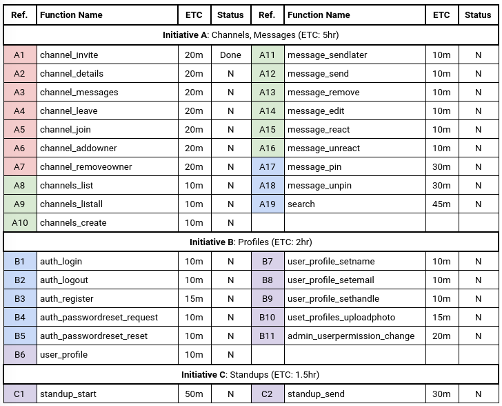

# Plan

Our team will be following the structure given by the table below, where each member has been assigned a set of functions to implement, and an estimated time for completion. As a function is completed, we update the table.

## Task Modules

Task Modules (Code | Function (ETC - estimated time to complete); **Nancy** (red), **Eric** (green), **Clarence** (blue) , **Victor** (purple))

<!-- <table>
    <tr>
        <th>Ref.</th>
        <th>Function Name</th>
        <th>ETC</th>
        <th>Status</th>
        <th>Ref.</th>
        <th>Function Name</th>
        <th>ETC</th>
        <th>Status</th>
    </tr>
    <tr>
        <td colspan=8 style="text-align: center; vertical-align: middle"><strong>Initiative A:</strong> Channels, Messages (ETC: 5hr)</td>
    </tr>
    <tr>
        <td bgcolor="#ff9999">A1</td>
        <td>channel_invite</td>
        <td>20m</td>
        <td>N</td>
        <td bgcolor="#adebad">A11</td>
        <td>message_sendlater</td>
        <td>10m</td>
    </tr>
    <tr>
        <td bgcolor="#ff9999">A2</td>
        <td>channel_details</td>
        <td>20m</td>
        <td>N</td>
        <td bgcolor="#adebad">A12</td>
        <td>message_send</td>
        <td>10m</td>
        <td>N</td>
    </tr>
    <tr>
        <td bgcolor="#ff9999">A3</td>
        <td>channel_messages</td>
        <td>20m</td>
        <td>N</td>
        <td bgcolor="#adebad">A13</td>
        <td>message_remove</td>
        <td>10m</td>
        <td>N</td>
    </tr>
    <tr>
        <td bgcolor="#ff9999">A4</td>
        <td>channel_leave</td>
        <td>20m</td>
        <td>N</td>
        <td bgcolor="#adebad">A14</td>
        <td>message_edit</td>
        <td>10m</td>
        <td>N</td>
    </tr>
    <tr>
        <td bgcolor="#ff9999">A5</td>
        <td>channel_join</td>
        <td>20m</td>
        <td>N</td>
        <td bgcolor="#adebad">A15</td>
        <td>message_react</td>
        <td>10m</td>
        <td>N</td>
    </tr>
    <tr>
        <td bgcolor="#ff9999">A6</td>
        <td>channel_addowner</td>
        <td>20m</td>
        <td>N</td>
        <td bgcolor="#adebad">A16</td>
        <td>message_unreact</td>
        <td>10m</td>
        <td>N</td>
    </tr>
    <tr>
        <td bgcolor="#ff9999">A7</td>
        <td>channel_removeowner</td>
        <td>20m</td>
        <td>N</td>
        <td bgcolor="#b3ecff">A17</td>
        <td>message_pin</td>
        <td>30m</td>
        <td>N</td>
    </tr>
    <tr>
        <td bgcolor="#adebad">A8</td>
        <td>channels_list</td>
        <td>10m</td>
        <td>N</td>
        <td bgcolor="#b3ecff">A18</td>
        <td>message_unpin</td>
        <td>30m</td>
        <td>N</td>
    </tr>
    <tr>
        <td bgcolor="#adebad">A9</td>
        <td>channels_listall</td>
        <td>10m</td>
        <td>N</td>
        <td bgcolor="#b3ecff">A19</td>
        <td>search</td>
        <td>45m</td>
        <td>N</td>
    </tr>
    <tr>
        <td bgcolor="#adebad">A10</td>
        <td>channels_create</td>
        <td>10m</td>
        <td>N</td>
        <td></td>
        <td></td>
        <td></td>
        <td></td>
    </tr>
    <tr>
        <td colspan=8 style="text-align: center; vertical-align: middle"><strong>Initiative B:</strong> Profiles (ETC: 2hr)</td>
    </tr>
    <tr>
        <td bgcolor="#b3ecff">B1</td>
        <td>auth_login</td>
        <td>10m</td>
        <td>N</td>
        <td bgcolor="#ddccff">B7</td>
        <td>user_profile_setname</td>
        <td>10m</td>
        <td>N</td>
    </tr>
    <tr>
        <td bgcolor="#b3ecff">B2</td>
        <td>auth_logout</td>
        <td>10m</td>
        <td>N</td>
        <td bgcolor="#ddccff">B8</td>
        <td>user_profile_setemail</td>
        <td>10m</td>
        <td>N</td>
    </tr>
    <tr>
        <td bgcolor="#b3ecff">B3</td>
        <td>auth_register</td>
        <td>15m</td>
        <td>N</td>
        <td bgcolor="#ddccff">B9</td>
        <td>user_profile_sethandle</td>
        <td>10m</td>
        <td>N</td>
    </tr>
    <tr>
        <td bgcolor="#b3ecff">B4</td>
        <td>auth_passwordreset_request</td>
        <td>10m</td>
        <td>N</td>
        <td bgcolor="#ddccff">B10</td>
        <td>uset_profiles_uploadphoto</td>
        <td>25m</td>
        <td>N</td>
    </tr>
    <tr>
        <td bgcolor="#b3ecff">B5</td>
        <td>auth_passwordreset_reset</td>
        <td>10m</td>
        <td>N</td>
        <td bgcolor="#ddccff">B11</td>
        <td>admin_userpermission_change</td>
        <td>20m</td>
        <td>N</td>
    </tr>
    <tr>
        <td bgcolor="#ddccff">B6</td>
        <td>user_profile</td>
        <td>10m</td>
        <td>N</td>
        <td></td>
        <td></td>
        <td></td>
        <td></td>
    </tr>
    <tr>
        <td colspan=8 style="text-align: center; vertical-align: middle"><strong>Initiative B:</strong> Profiles (ETC: 2hr)</td>
    </tr>
    <tr>
        <td bgcolor="#ddccff">C1</td>
        <td>standup_start</td>
        <td>50m</td>
        <td>N</td>
        <td bgcolor="#ddccff">C2</td>
        <td>standup_send</td>
        <td>30m</td>
        <td>N</td>
    </tr>
</table> -->

## Timeline
- Week 3 (30/09-06/10): **I1 DUE**
  - Progress check on Wednesday
  - Pytests by Thursday
- Week 4 (07/10-13/10): **I2 RELEASED**
  - A1-18, B1-B11
- Week 5 (14/10-20/10):
  - A19, C1-C2
- Week 6 (21/10-27/10): **I2 DUE**
  - Final checks

## Software tools
Our team will use `pylint` with custom settings so that every team member will be following a strict guideline on the style of their code in Iteration 2, regardless of the text editor we use. With our knowledge of `pytest`and the use of coverage testing software, such as `coverage.py` to examine the effectiveness of our tests as we finish functions, we can further refine and develop our tests. We will also be using online messaging and streaming software to communicate and have an opportunity to program in pairs. There will also be regular code reviews of code that was pushed onto Gitlab, in addition to Gitlab's feature for other members to review code before a merge.  
